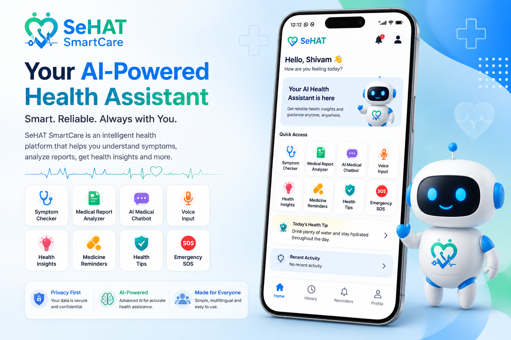
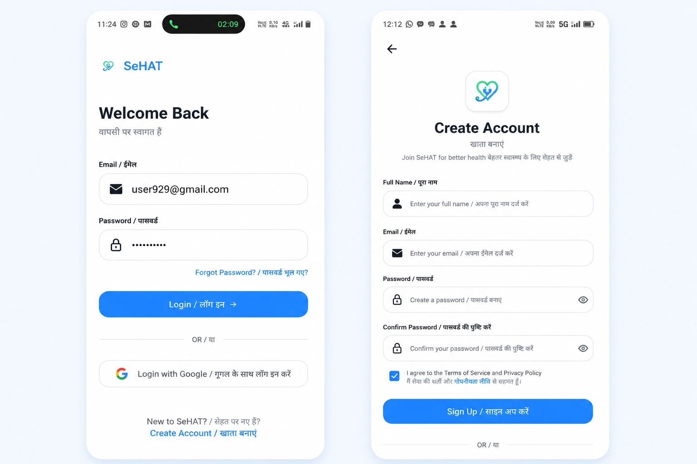
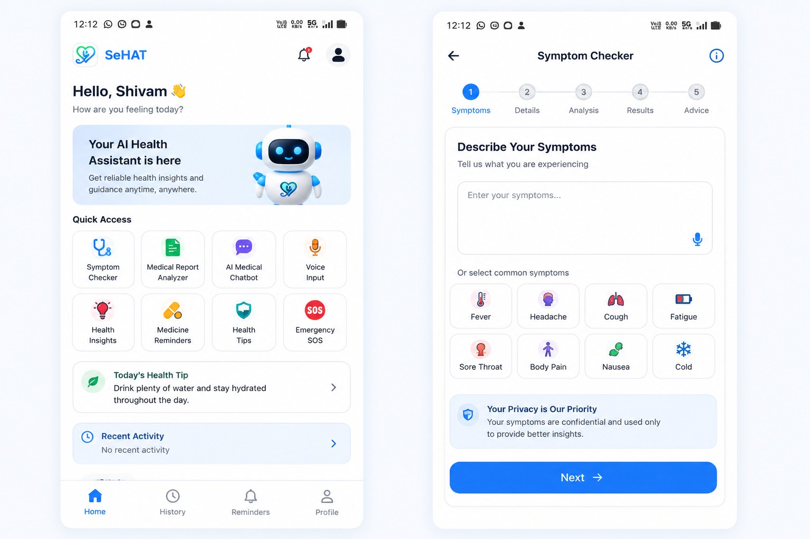
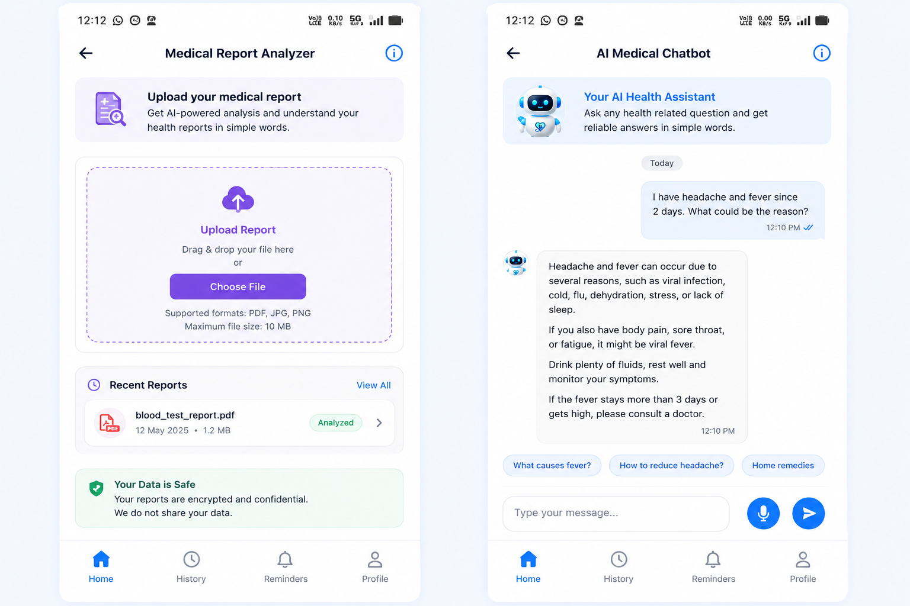
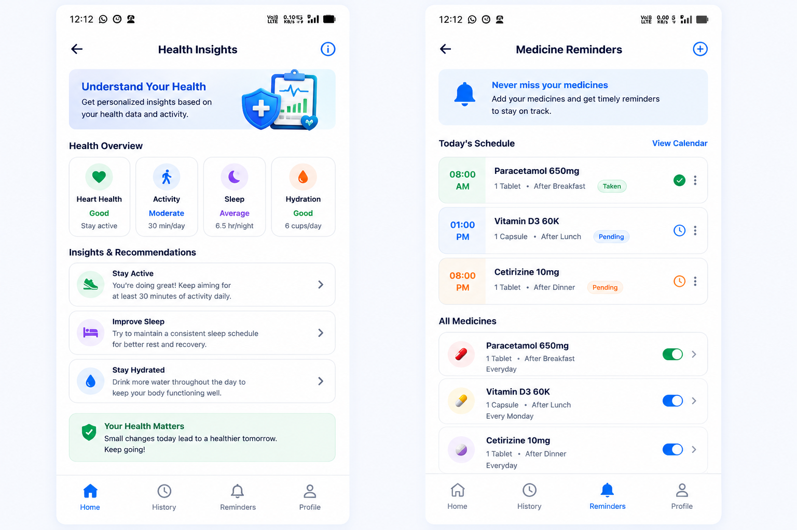
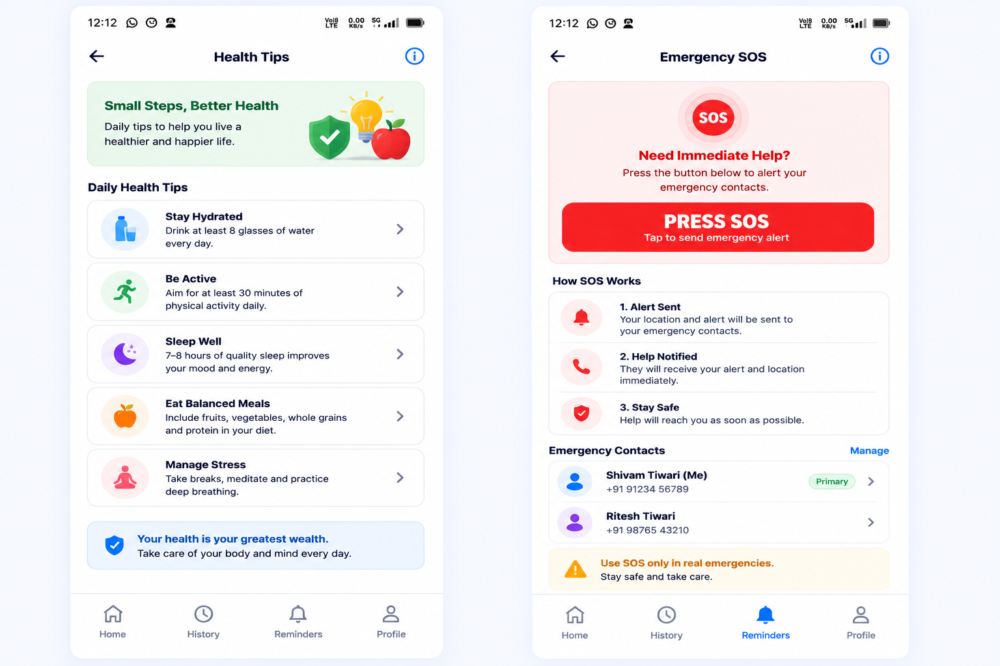
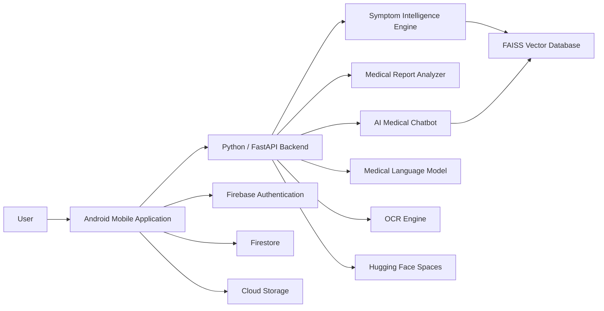

# 🩺 SeHAT SmartCare AI

> **An Intelligent Mobile Health Assistant using Artificial
> Intelligence, RAG and Medical Language Models**

SeHAT SmartCare AI is an AI-powered Android healthcare assistance
platform designed to help users understand symptoms, interpret medical
reports, and access health information through an intelligent
conversational assistant.

The system combines **Artificial Intelligence, NLP, Large Language
Models, Retrieval-Augmented Generation (RAG), semantic embeddings, FAISS
vector search, OCR, Android development, and cloud services** into a
healthcare-focused mobile application.

> **Medical disclaimer:** SeHAT SmartCare is intended for preliminary
> health information and assistance only. It is not a replacement for
> professional medical diagnosis, treatment, or emergency services.

------------------------------------------------------------------------

## 📸 Project Preview

> Replace the image paths below with the actual files you upload to
> GitHub.

### Hero / Project Overview



### Authentication

  Login & Sign-up
  ------------------------------------------------------
  

### Main Application

  Home Dashboard & Symptom Checker
  -------------------------------------------------------------
  

### AI & Medical Analysis

  Medical Report Analyzer & AI Medical Chatbot
  ------------------------------------------------------------------
  

### Health Assistance

  -----------------------------------------------------------------------
  Health Insights & Medicine Reminders
  -----------------------------------------------------------------------
  

  -----------------------------------------------------------------------

### Safety & Wellness

  Health Tips & Emergency SOS
  --------------------------------------------------------------
  

------------------------------------------------------------------------

# 📌 Table of Contents

-   [Project Overview](#-project-overview)
-   [Problem Statement](#-problem-statement)
-   [Objectives](#-objectives)
-   [Key Features](#-key-features)
-   [System Architecture](#-system-architecture)
-   [Complete Workflow](#-complete-system-workflow)
-   [Symptom Intelligence Engine](#-symptom-intelligence-engine)
-   [Medical Report Analyzer](#-medical-report-analyzer)
-   [AI Medical Chatbot](#-ai-medical-chatbot)
-   [Vector Knowledge Database](#-vector-knowledge-database)
-   [Voice Input](#-voice-input)
-   [Authentication and Cloud Data](#-authentication-and-cloud-data)
-   [Technology Stack](#-technology-stack)
-   [Application Modules](#-application-modules)
-   [Testing](#-testing)
-   [Security and Privacy](#-security-and-privacy)
-   [Advantages](#-advantages)
-   [Limitations](#-limitations)
-   [Future Enhancements](#-future-enhancements)
-   [Project Structure](#-project-structure)
-   [Source Code Availability](#-source-code-availability)
-   [Academic Information](#-academic-information)
-   [Disclaimer](#-disclaimer)

------------------------------------------------------------------------

# 🚀 Project Overview

SeHAT SmartCare AI provides a mobile-first interface for preliminary
health assistance.

Users can:

-   Enter symptoms and receive possible disease matches.
-   Upload medical reports as images or PDFs.
-   Extract report text using OCR.
-   Identify medical parameters and abnormal values.
-   Ask health-related questions through an AI chatbot.
-   Interact in **English, Hindi, and Hinglish**.
-   Use voice input for symptoms and questions.
-   View health insights and general recommendations.
-   Create medicine reminders.
-   Read general health tips.
-   Use an Emergency SOS assistance workflow.

The system is organized into three major layers:

1.  **Android Mobile Application**
2.  **AI Processing Backend**
3.  **Cloud Data and Storage Services**

------------------------------------------------------------------------

# ❗ Problem Statement

Medical information is often difficult for non-medical users to
understand. Symptoms may be confusing, laboratory reports contain
technical terminology, and conventional search can return large amounts
of fragmented information.

SeHAT SmartCare AI addresses this challenge by combining a simple mobile
interface with AI-assisted symptom analysis, medical report
interpretation, semantic medical knowledge retrieval, and conversational
health assistance.

------------------------------------------------------------------------

# 🎯 Objectives

-   Develop an AI-powered healthcare assistance application.
-   Provide preliminary symptom analysis.
-   Analyze medical reports using OCR and AI.
-   Provide an intelligent medical chatbot.
-   Support English, Hindi, and Hinglish.
-   Support voice-based interaction.
-   Use semantic embeddings for medical knowledge retrieval.
-   Demonstrate RAG in a healthcare application.
-   Present complex medical information in simpler language.
-   Demonstrate a scalable Android + AI backend + cloud architecture.

------------------------------------------------------------------------

# ✨ Key Features

## 1. 🩺 AI Symptom Checker

Users can enter symptoms such as fever, cough, headache, fatigue, sore
throat, body pain, nausea, and cold.

The system extracts important symptoms, creates semantic embeddings,
searches the FAISS knowledge index, ranks relevant disease entries, and
returns the top matches with general health guidance.

Example:

``` text
Influenza      — 72%
Viral Fever    — 65%
Common Cold    — 53%
```

These are similarity/matching scores and should not be interpreted as
clinical probabilities.

## 2. 📄 Medical Report Analyzer

Users can upload blood or medical reports in image/PDF format.

Pipeline:

``` text
Report Upload
    ↓
Image Pre-processing
    ↓
OCR Text Extraction
    ↓
Medical Parameter Extraction
    ↓
Structured Feature Generation
    ↓
Reference Range Comparison
    ↓
Abnormal Value Detection
    ↓
Medical LLM Explanation
    ↓
User-friendly Output
```

## 3. 🤖 AI Medical Chatbot

Users can ask questions such as:

``` text
Why do I have fever?
What does low hemoglobin mean?
What can cause a headache?
How can I reduce fever?
```

The chatbot uses language detection, query embeddings, FAISS retrieval,
contextual prompting, and a medical language model.

Supported languages:

-   English
-   Hindi
-   Hinglish

## 4. 🎙️ Voice Input

``` text
Voice Input
    ↓
Speech-to-Text
    ↓
AI Processing
    ↓
Response Generation
    ↓
Health Insight
```

## 5. 💡 Health Insights

Provides simple wellness information and recommendations based on the
application's available health information and interactions.

## 6. 💊 Medicine Reminders

Users can create reminders containing medicine names, schedule times,
frequency, and reminder status.

## 7. 🌿 Health Tips

Provides general guidance related to hydration, physical activity,
sleep, balanced meals, and stress management.

## 8. 🚨 Emergency SOS

Provides an assistance workflow for alerting configured emergency
contacts.

> This feature does not replace local emergency services.

------------------------------------------------------------------------

# 🏗️ System Architecture



### Architecture Layers

**User Layer:** Android interfaces for authentication, health tools,
results, and navigation.

**Mobile Application Layer:** Handles input, validation, API
communication, report selection/upload, voice input, navigation, and
result visualization.

**AI Backend Layer:** Python/FastAPI services containing the Symptom
Intelligence Engine, Medical Report Analyzer, Medical Chatbot, RAG
pipeline, vector search, OCR processing, and model integration.

**Vector Knowledge Layer:** Medical information converted into semantic
embeddings and indexed using FAISS.

**Cloud Data Layer:** Firebase Authentication, Firestore, and Cloud
Storage.

------------------------------------------------------------------------

# 🔄 Complete System Workflow

``` text
User
 ↓
Android Application
 ↓
API Request
 ↓
Python / FastAPI Backend
 ↓
Input Processing
 ↓
Relevant AI Engine
 ↓
Vector / OCR Processing
 ↓
Medical Context
 ↓
Medical Language Model
 ↓
Generated Health Insight
 ↓
API Response
 ↓
Android Application
 ↓
User
```

------------------------------------------------------------------------

# 🩺 Symptom Intelligence Engine

### Pipeline

``` text
User Symptoms
      ↓
LLM Extracts Key Symptoms
      ↓
Text Pre-processing
      ↓
Sentence Embedding
(all-MiniLM-L6-v2)
      ↓
FAISS Vector Similarity Search
      ↓
Disease Similarity Scoring
      ↓
Top 3 Disease Predictions
      ↓
Health Recommendations
```

The user's natural-language symptoms are converted into meaningful
symptom concepts. The processed text is transformed into embeddings
using `all-MiniLM-L6-v2`. FAISS then searches the medical knowledge
index for semantically similar entries.

------------------------------------------------------------------------

# 📄 Medical Report Analyzer

### Pipeline

``` text
Image / PDF
    ↓
Image Pre-processing
    ↓
Tesseract / Applicable OCR
    ↓
Extracted Medical Text
    ↓
Medical Parameter Extraction
    ↓
Structured Data
    ↓
Reference Range Comparison
    ↓
Abnormal Value Detection
    ↓
Medical LLM
    ↓
Simplified Explanation
```

The analyzer is intended to help users understand report values in
simpler language. OCR accuracy depends on document quality, layout,
image resolution, and report formatting.

------------------------------------------------------------------------

# 🤖 AI Medical Chatbot --- RAG Architecture

``` text
User Question
      ↓
Language Detection
      ↓
Query Embedding
      ↓
FAISS Vector Search
      ↓
Relevant Medical Context
      ↓
Context + User Question
      ↓
Prompt Template
      ↓
Medical Language Model
      ↓
Grounded Answer
      ↓
Mobile Application
```

RAG adds a retrieval step before generation. Relevant medical knowledge
is retrieved from the vector index and supplied to the language model as
context. This is designed to improve relevance and reduce unsupported
model responses.

------------------------------------------------------------------------

# 🗃️ Vector Knowledge Database

The system uses **FAISS** for vector similarity search.

### Stored Knowledge

-   Diseases and descriptions
-   Symptoms and clinical significance
-   Medical explanations
-   Health-related guidance

### Construction Process

``` text
Medical Text Documents
        ↓
Text Chunking
512 Tokens / 64 Token Overlap
        ↓
SentenceTransformer
(all-MiniLM-L6-v2)
        ↓
Vector Embeddings
        ↓
FAISS Index
        ↓
Similarity Search
```

The vector retrieval layer supports workflows including the Symptom
Checker and AI Medical Chatbot.

------------------------------------------------------------------------

# ☁️ Cloud Infrastructure

The AI backend is deployed using **Hugging Face Spaces**.

It is responsible for:

-   Backend hosting
-   AI model execution
-   API request processing
-   Vector search
-   AI inference

Firebase services are used for application authentication and cloud
data/file management.

------------------------------------------------------------------------

# 🔐 Authentication and Cloud Data

### Firebase Authentication

Used for:

-   User registration
-   User login
-   Authentication management

### Firestore

Used for structured application data such as:

-   User information
-   Symptom-check history
-   Analysis results
-   Chat sessions
-   Medicine reminders

### Cloud Storage

Used for uploaded medical reports and report-related files.

------------------------------------------------------------------------

# 🧩 Application Modules

  Module               Purpose
  -------------------- -------------------------------------
  Authentication       Login and account creation
  Home Dashboard       Central health-assistance interface
  Symptom Checker      AI-assisted symptom analysis
  Report Analyzer      OCR + medical report interpretation
  AI Chatbot           RAG-based health conversation
  Voice Input          Speech-based interaction
  Health Insights      General health information
  Medicine Reminders   Medication schedule reminders
  Health Tips          General wellness guidance
  Emergency SOS        Emergency contact assistance
  Records / History    Previous activities and results

------------------------------------------------------------------------

# 🧪 Testing

Important application workflows are tested using positive and negative
cases.

### Positive Login Test

``` text
Valid Email
     +
Valid Password
     ↓
Authentication Successful
     ↓
Home Dashboard
```

### Negative Login Test

``` text
Invalid Credentials
     ↓
Validation / Authentication Error
     ↓
Login Failed
```

### Positive Sign-up Test

``` text
Valid Name
+
Valid Email
+
Valid Password
+
Matching Confirmation
+
Terms Accepted
     ↓
Account Created Successfully
```

### Negative Sign-up Test

``` text
Invalid Email
or Weak Password
or Password Mismatch
or Terms Not Accepted
     ↓
Validation Error
     ↓
Sign-up Failed
```

Additional testing areas include symptom input, report upload, OCR
processing, chatbot responses, API communication, Firebase operations,
voice input, medicine reminders, and SOS workflow.

------------------------------------------------------------------------

# 🔒 Security and Privacy

Healthcare-related information requires careful handling.

The system follows privacy-conscious design principles such as:

-   Authenticated user access
-   Controlled report storage
-   Secure API communication
-   Separation of mobile, AI, and cloud layers
-   Avoidance of public exposure of private user information

### Never commit

``` text
API keys
Firebase secrets
Service-account credentials
Private tokens
Passwords
Production credentials
Private user medical data
```

------------------------------------------------------------------------

# 📈 Advantages

-   Quick access to preliminary health information
-   Simple mobile interface
-   English, Hindi, and Hinglish support
-   AI-assisted symptom analysis
-   Automated report text extraction
-   Semantic medical knowledge retrieval
-   RAG-based conversational assistance
-   Voice input
-   Cloud-enabled architecture
-   Modular and scalable design

------------------------------------------------------------------------

# ⚠️ Limitations

-   AI-generated information may not always be correct.
-   Similarity scores are not clinical probabilities.
-   OCR performance depends on report quality.
-   Complex medical cases require professional evaluation.
-   The system does not replace doctors or clinical diagnosis.
-   Model output depends on the quality and coverage of the medical
    knowledge base.
-   Emergency features should not replace official emergency services.

------------------------------------------------------------------------

# 🔮 Future Enhancements

Possible improvements include:

-   Hospital information-system integration
-   Doctor consultation integration
-   Real-time telemedicine
-   Wearable-device integration
-   Personalized health monitoring
-   Health trend visualization
-   More advanced medical AI models
-   Improved multilingual medical NLP
-   Expanded medical knowledge sources
-   Personalized health recommendations
-   Secure healthcare-system interoperability

------------------------------------------------------------------------

# 📁 Project Structure

The public repository can use a documentation-focused structure because
the production source code is private.

``` text
SeHAT-SmartCare-AI/
│
├── README.md
│
├── assets/
│   └── images/
│       ├── sehat-hero.png
│       ├── login-signup.png
│       ├── home-symptom.png
│       ├── report-chatbot.png
│       ├── insights-reminders.png
│       └── tips-sos.png
│
├── docs/
│   ├── architecture/
│   ├── diagrams/
│   └── project-report/
│
└── LICENSE
```

------------------------------------------------------------------------

# 🔒 Source Code Availability

## Why is the source code private?

The complete source code of **SeHAT SmartCare AI is not publicly
published**.

The project is presented publicly as a portfolio and academic
demonstration, while the production implementation remains private for
**privacy, security, and intellectual-property reasons**.

This repository focuses on:

-   Project overview
-   Architecture
-   AI workflows
-   Feature documentation
-   System diagrams
-   UI previews
-   Technology stack
-   Testing documentation

The repository intentionally does not contain private application source
code or production credentials.

------------------------------------------------------------------------

# 🎓 Academic Information

**Project:** SeHAT SmartCare AI\
**Category:** Artificial Intelligence / Healthcare / Android
Application\
**Domain:** AI-powered Digital Healthcare\
**Architecture:** Android + Python/FastAPI + Vector Search + Cloud
Services\
**Core AI:** Medical LLM + Embeddings + RAG\
**Vector Search:** FAISS\
**OCR:** Tesseract / applicable OCR services\
**Cloud:** Hugging Face Spaces + Firebase

The project demonstrates the practical integration of:

``` text
Mobile Application
        +
Artificial Intelligence
        +
Natural Language Processing
        +
Medical Language Models
        +
RAG
        +
Vector Database
        +
OCR
        +
Cloud Infrastructure
```

------------------------------------------------------------------------

# 🩺 Disclaimer

SeHAT SmartCare AI provides **AI-assisted health information and
preliminary guidance**.

It must not be used as a substitute for:

-   Professional medical diagnosis
-   Doctor consultation
-   Prescribed treatment
-   Emergency medical services

For severe, sudden, or life-threatening symptoms, users should seek
immediate professional medical care or contact their local emergency
service.

------------------------------------------------------------------------

# ⭐ Project Status

**Status: Completed / Demonstration Ready**

SeHAT SmartCare AI demonstrates an end-to-end healthcare-assistance
workflow from Android user interaction to AI processing, medical
knowledge retrieval, response generation, and cloud-backed data
management.

------------------------------------------------------------------------

```{=html}
<p align="center">
```
`<strong>`{=html}SeHAT SmartCare AI`</strong>`{=html}`<br>`{=html}
Intelligent Assistance for Better Understanding of Health Information
```{=html}
</p>
```
